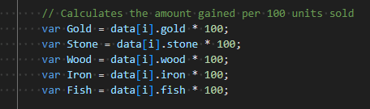
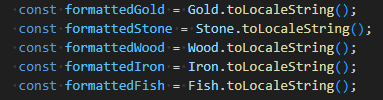
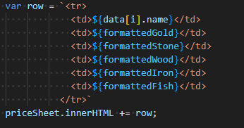

# Fan Made Seaport Market Profit Table

## This is a simple Seaport Fan made table to show how much you can get selling stuff to the market.

### Description
I created this table to help determain what products in the game sells the most. Each product is calculated by one hundred units to simplify things. By cross checking the payment you can find the item that would provide the most income for you. All data was collected from personally checking the market in my own account in the game, and no use of other external sites was used to collect the data used in this project.

### Technical information

To get the data for this tabel I first had to check the market in game for the trade ratio on items sellable there. In order to be used it had to be stored inside an array:

get technical in this section with diagrams and stuff.

Next came the need to create the function that would generate the rows for my table. A method was used to calculate the total amount for each resource you could trade for based on a average of one hundred units sold. 

By using this method i could save having to do the calculations in each part of the array for the same item. This could have been done in the section to display the rows with the relevent data but doing so prevented having commas seperating the numbers for easier reading. This is why each item you can trade for is set to a variable which is inside the function used to display our rows.

in order to have the commas in our displayed numbers I had to use the following code:

Formatting the variables above to a string allowed me to add the commas, which in turn made reading the table better. Finally I had to get my script to display the data to the web page. to do so I created the table rows inside the script and had it pass the formatted data inside the `<td></td>` tags. This way only one row would be needed to be written and the script will create all rows needed for all the data in the array.

### How to report issues or requests
To report any issues with the web page please head to [Report issues / suggestions](https://github.com/Danhayes3008/Seaport-market-income/issues) to file a ticket. A better version is planned so any issues or suggestions may be used for that one, as these projects are for my own educational benefit.

### Known issues and future updates
* More items will be added to the array

* items will be organised better

* Add the ability to pull the most profitable item to top of the list for each payment you can receive, this will make it easier to find what you need.

* table does not work well with other devices and can only be used on Pc right now. This will be fixed so it can be veiwed on all devices eventually

* styling will be updated for more pleasant look later on as this is not a major issue right now.

* the JS file will be slit between two, one to contain the array in order to make it simpler to adjust and another to display it on the web page.